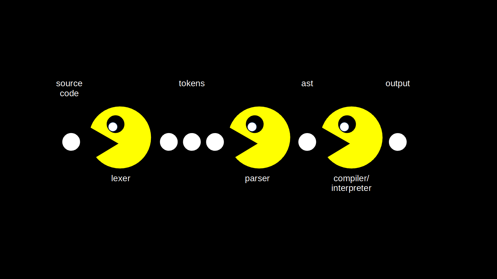

# `FsLexYacc`

---



---

# CS 101
- Automata accept words from a language
- Grammars produce words from a language
- Parsers produce trees

---

_Parser generators_ generate parsers from grammars

FsLexYacc is a parser generator written in F#

It generates a LALR(1) parser, which is a bottom-up parser
---

The word _parser_ is often used for the combination of a lexer and parser  

_Lexer_: lexical analyzer, scanner, tokenizer

---

_bottom-up parser_: starts with the input and tries to reduce it to the start symbol


_reducing_: replace a sequence of symbols matching the rhs of a production rule with the non-terminal symbol, the lhs of the rule


_shifting_: moving the next token to the top of the stack (if state transition is possible)

---

What are the boundaries between lexer and parser?  
What should be a token?  
Some guidelines:

- Lexer should discard everything that is not needed later
- Things that the parser needs to distinguish should be recognized as different tokens
- Things that the parser does not need to distinguish could be grouped into one token

---

Start with `dotnet add package FsLexYacc`

MSBuild targets are added to generate the lexer and parser

`dotnet msbuild -targets`
`dotnet msbuild /t:CallFsLex`
`dotnet msbuild /t:CallFsYacc`

---

# Basic structure of a yacc file

```
%{
open YourAstNamespace
// helper functions
%}

// start token
%start start

// tokens, used by lexer
%token <int> INT
%token LEFT_PAREN
%token RIGHT_PAREN
%token EOF

// precedence and associativity
%left TOKEN1 TOKEN2
%left TOKEN3 TOKEN4

// return type of parser, marked by start token
%type <Expr option> start

%%

// production rules:
// rule name: matching expression with TERMINALS and non-terminals { action as F# code }
start: prog { $1 }

prog:
  | EOF { None }
  | expr { Some $1 }

expr:
  | INT { Int $1 }

```

---

The return type of the parser is specified with `%type` and `start`

```fsharp
%type < YourType > start
```

But your production rules can return any type along the way

```fsharp
%type < YourType2 >
%type < YourType3 >
%type < YourType4 >
```

---

Specify associativity and precedence with
```
%left
%right
%nonassoc
%prec
```

later defined precedence levels are higher

---

# Basic structure of a lex file

```
{

module Lexer

open FSharp.Text.Lexing
open System
open YourParserNamespace

exception SyntaxError of string

let lexeme = LexBuffer<_>.LexemeString

let newline (lexbuf: LexBuffer<_>) = 
  lexbuf.StartPos <- lexbuf.StartPos.NextLine
}

// regex macros
let int = ['-' '+']? ['0'-'9']+
let white = [' ' '\t']+
let newline = '\r' | '\n' | "\r\n"

// rules
rule read =
  parse
  | white    { read lexbuf }
  | newline  { newline lexbuf; read lexbuf }
  | int      { INT (int (lexeme lexbuf)) }
  | '*'      { STAR }
  | eof      { EOF }
  | _ { raise (Exception (sprintf "SyntaxError: Unexpected char: '%s' Line: %d Column: %d" (lexeme lexbuf) (lexbuf.StartPos.Line + 1) lexbuf.StartPos.Column)) }
```